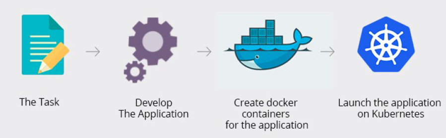
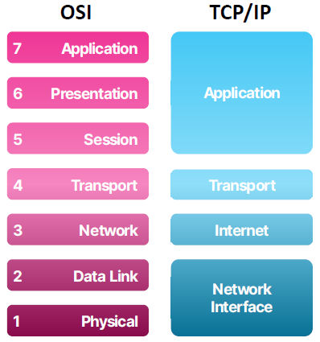
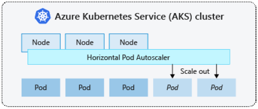

# Kubernetes (k8s)
Kubernetes is a **portable, extensible, open-source** platform for **managing containerized workloads** and **services**, that facilitates both **declarative configuration** and **automation**. It has a large, rapidly growing ecosystem. Kubernetes services, support, and tools are widely available.”

- Service discovery and load balancing
- Storage orchestration
- Automated rollouts and rollbacks
- Self-healing
  - Als er iets fout gaat, zal hij proberen het zelf terug te herstellen.
- Auto scaling

## Hoe aan de slag gaan
Vertrekken van een Docker applicatie
  

## Architecture
Twee groepen:
- Master
  - Scheduler
  - Controller
  - etcd
  - API server (zichzelf - worker nodes)
- Nodes

+ Nathan's VM: master
+ Onze eigen VM: worker node

### Control Plane / Kubernetes Master**
- **Scheduler**
  - Ervoor zorgen dat het aantal gewenste pods draait
  - Bijhouden van capaciteit en resources van nodes
  - Werk geven aan nodes a.d.h.v. beschikbaarheid
- **Controller**
  - Registreren van nodes
  - Monitoren van health van nodes (leeft de VM nog?)
- **etcd**
  - Persistent and distributed key-value data store
  - Opslaan wat de configuratie van de cluster is
  - State en data bijhouden nodig om onze cluster opnieuw te kunnen opbouwen
  - Welke VM's zijn er actief
  - Welke data draait er allemaal
- **API-server**
  - Connectie tussen master node en worker nodes (VM's)

*Controller checkt of een VM actief is: bv. geen werk meer geven bij downtime.*

### (Worker) Node
- **Kubelet**
  - State van de node beheren
    - Starten, stoppen en onderhouden van applicatiecontainers met constructies van de control plane
  - Performance and health information van node, pods, containers bijhouden
    - Delen met de control plane
- **Kube-Proxy**
  - Network proxy
  - Virtuele IP adressen van pods en services beheren
  - Soort load balancer voor alle services op die node
- **Pod**
  - Te vergelijken met een (docker) container

### Objects
Entiteiten in Kubernetes die ook persistent zijn.

Record of intent = "ik wil zo'n object"

Je kan aangeven:
- Welke containerized applicaties draaien (en op welke nodes)
- Welke resources er beschikbaar zijn ervoor (*bv. X RAM*)
- Restart policies, upgrades...

Je geeft een instructie aan Kubernetes en hij doet zijn best om eraan te voldoen.

### Building blocks
Enkele building blocks die je kan aanvragen
- **Pods**
- **Services** and EndPoints
- **Deployments**
- ReplicaSets
- DaemonSets
- StatefulSets
- **Ingress**
- PersistentVolumes and PersistentVolumeClaims
- ConfigMaps and Secrets

### Pods
Een **Pod** is een soort docker container.

The Pod serves as a kind of basic, functional unit. It is a set of containers, along with their **shared volumes**.

De scheduler kan deze pods onverwachts aanmaken en verwijderen. Je moet niet vertrouwen op één pod.

Om je applicatie op een voorspelbare manier te kunnen bereiken, heb je een makkelijke vorm van load balancing: een **Service**.

### Service
Logisch samenraapsel van pods.
De service weet waar deze pods staan.

Via de service kan je "een vrije pod" gaan krijgen.

Services hebben een IP adres, die redelijk stabiel zijn.

*Een client never connects to a container, but to a Pod, trough a Service.*

### Deployments
YAML objecten die instaan voor welke pods en hoeveel je er wil opstarten.

ReplicaSet, DaemonSet of StatefulSet

### ReplicaSets
ReplicaSet zorgt ervoor dat het aantal replicas dat je wil voorzien wordt. Waar, maakt niet uit.

If a node running a pod dies, the replica set will ensure that another pod is scheduled on another available node.

### DaemonSets
Zorgt ervoor dat alle (of sommige) nodes een kopie van een pod draaien. Bij het aanmaken van een node, wordt een pod toegevoegd.

Typische use cases:
- Running a cluster storage daemon, such as glusterd, ceph, on each node
- Running a logs collection daemon on every node, such as fluentd or filebeat

### StatefulSets
Gaan je applicatie hosten op nodes met identieke container specs. Ervoor zorgen dat die sticky blijft staan op een VM.

Stel een VM gaat dood en komt later terug, gaat de pod terugkomen op die VM.

### PersistentVolumes and PersistentVolumeClaims
- **PersistentVolumes**
  - Storage volume in de cluster
  - Independent lifecycle: niet gebonden aan je applicatie. Blijft staan.
  - Data blijft persistent, ook na het afsluiten van onze pods of containers.
  - Op deze VM is x GB voorzien voor...
- **PersistentVolumeClaims**
  - Toegang tot een volume aanvragen

### ConfigMaps and Secrets
Apart Kubernetes object die je kan delen met andere pods.

Verschil: secrets bevatten confidentiële info (secrets)

Environment variabelen niet hardcoden binnen applicatie.

Verschillende environments veranderen: verschillende configmap voor development, staging, production..

### Load Balancer
- **L4 Load Balancing (TCP)**
  - Alleen beschikbaar op Kubernetes Cloud Providers
- **L7 Load Balancing**
  - Redirect traffic to specific workloads based on request
  - Naar welke applicatie moet ik mijn data gaan doorsturen?
  - **Ingress**

  

- **Kube-proxy**
  - **Load distribution**
  - Geef mij een Pod die beschikbaar is
  - Default: Randomly route to IP addresses based on iptables
- **Ingress**
  - Met bepaalde rules werken.
    - *My-website.com/netflix > Elias*
    - *My-website.com/youtube > Nathan*
  - Via Rancher kan je dat makkelijk deployen.

### Autoscaler
Gebruikt een **horizontal pod autoscaler (HPA)**.

Gaat de resources gaan managen en kijken wat ik vraag.

*Bv. je hebt 10GB RAM nodig. Kan ik hem dat geven: nee? > Proberen toch te geven (opschalen met pods)*

  

Draait bovenop worker nodes.

Deze nodes draaien pods (nu 3).

Komen we daar niet mee toe? Maken we er bij (2).

Ervoor zorgen dat iedereen pods genoeg ter beschikking heeft.

### YAML file
```yaml
# Welke versie van de API
apiVersion: apps/v1

# Wat voor object wil je creëren?
kind: Deployment

# Data waarmee we ons object kunnen identificeren
metadata:
  # name, UID and optional namespace
  name: nginx-deployment

# Status van het object
# "Dit wil ik"
spec:
  selector:
    matchLabels:
      app: nginx
  replicas: 2 # hoeveel replica's (pods)

  # Configuratie
  template:
    metadata:
      labels:
        app: nginx
    # Verschillende specs voor containers
    spec:
      containers:
      - name: nginx
        image: nginx:1.14.2
        ports:
        - containerPort: 80
```

### Helm
Package manager software (soort npm), waarmee we custom Helm charts gaan maken.

Helm chart = verzameling YAML files die we makkelijk kunnen gaan installeren.

## Rancher
Rancher is a complete software stack for teams adopting containers. it addresses the operational and security challenges of managing multiple Kubernetes clusters, while providing DevOps teams with integrated tools for running containerized workloads.

- Simple, intuitive UI to get started with Kubernetes
- **Multi-cloud** and **hybrid-cloud** Kubernetes solutions
- Fast way to set up **on-premises** Kubernetes clusters
- Includes CI/CD pipelines for DevOps operations

### Ports
Node Port > Open to public
Cluster IP > Only open in k8s

## Summary
- Why Kubernetes is useful for microservices
- Kubernetes Building Blocks
- How autoscaling in Kubernetes works
- Different kinds of Load Balancing options
- How to write a YAML file for a Kubernetes object
- What the advantages of Helm charts are
- What Rancher does for us

# 