# gRPC
## Microservices
- **Strenghts** of microservices
  - Independent components
  - Easier understanding
  - Better **scalability**
- **How to manage?**
  - Containers
  - DevOps
- **Cons**
  - Requires stable APIs
  - Hard integration testing

## APIs
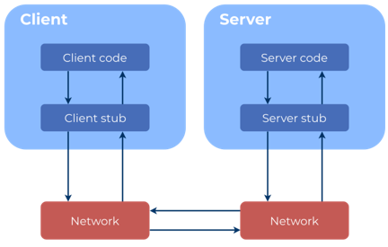  
- Old way: RPC (Remote Procedure Call)
  - Since 1970
  - Request-response protocol
  - Call method on (remote) server
  - Use "stubs"
  - Made for (possibly) slow networks
    - Timeout

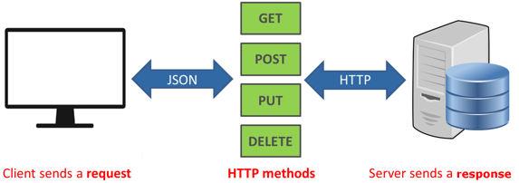  

+ Classic / Modern web: REST
  + Uniform interface
  + Client-server
  + Stateless
  + Cacheable
  + Layered system
  + Code on demand
  + Text-based and relatively easy to debug
  + Well-supported in most languages

- REST: **problems**
  - HTTP/1 is not performant
  - Text-based protocol is developer-friendly but inefficient
  - Streaming is difficult
  - Semantics:
    - POST/PUT/PATCH
    - Status codes & error responses
    - Single vs. plural resource names
    - ID in param or in body
    - *Ene API returnt altijd 200, andere 200, 201...*

### OpenAPI vs REST
- REST:
  - Manual/custom documentation

- OpenAPI:
  - Automatic documentation
    - Which requests exists
    - What replies to expect
  - *bv Swagger*

## gRPC
In gRPC, a client application can directly call a method on a server application on a different machine as if it were a local object, making it easier for you to create distributed applications and services.

### gRPC vs OpenAPI
- Both are **interface definition languages** (IDLS)
  - **OpenAPI exposes** the details of the underlying **HTTP transport** to the client and allows the API designer to control the mapping
  - **gRPC hides** all the **HTTP details** using a predefined mapping


+ gRPC calls a **procedure** for which **params are calculated** and a **stub** is called
+ OpenAPI calls an **url path** for which **params are calculated** and a **HTTP req** is made

### gRPC
- Local calls, no thinking about http requests
- Protobuf instead of JSON
- Built on HTTP 2 instead of HTTP 1.1
- In-Born Code Generation Instead of using Third-Party Tools Like Swagger
- 7-10x faster message transmission

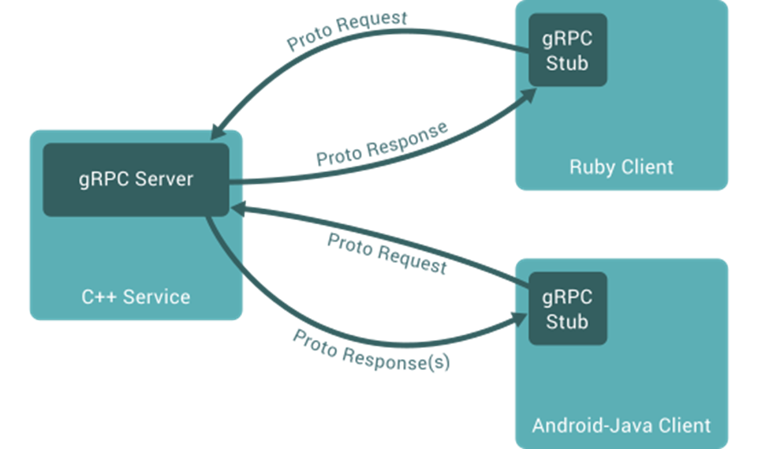  


### HTTP/1.1 vs HTTP/2
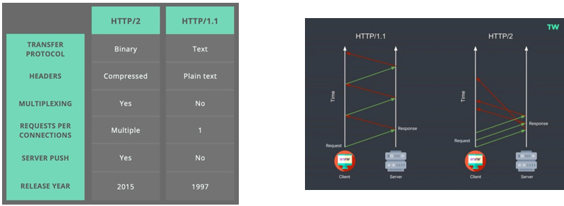  

### Protocol Buffers (proto3)
- Binary serialization mechanism for structured data
- Hard to decode by human eye (schema is needed)

+ XML (minify > ascii to binary)
  + 656 bytes
+ JSON (minify > ascii to binary)
  + 440 bytes

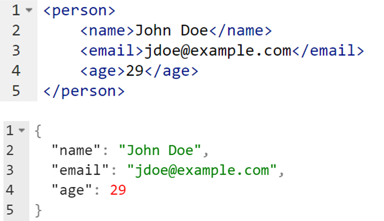  


**Protobuf (hex)**
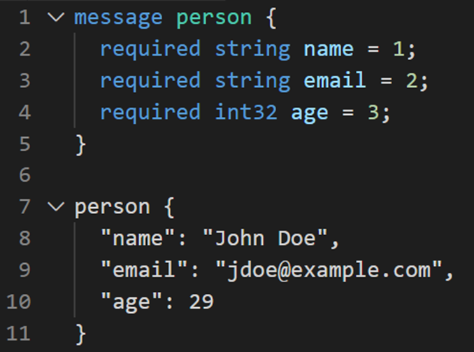  

```
0A084A6F686E20446F6512106A646F65406578616D706C652E636F6D181D
```
Binary

```
00001010 00001000 01001010 01101111 01101000 01101110 00100000 01000100 01101111 01100101 00010010 00010000 01101010 01100100 01101111 01100101 01000000 01100101 01111000 01100001 01101101 01110000 01101100 01100101 00101110 01100011 01101111 01101101 00011000 00011101
```
= 236 bytes

### Protocol Buffers: Message type
Each field has a
- Type
- Name
- Field number (used for serialization)

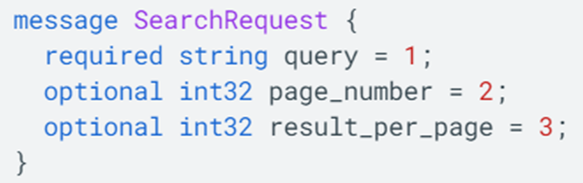  

### Protocol Buffers: Binary encoding
- Binary encoding
- Key - value
- Non-human readable
- First 15 fields encoded in 1 byte (efficient)

```
0A 08 4A 6F 68 6E 20 44 6F 65
```
```
00001010 00001000 01001010 01101111 01101000 01101110 00100000 01000100 01101111 01100101
```
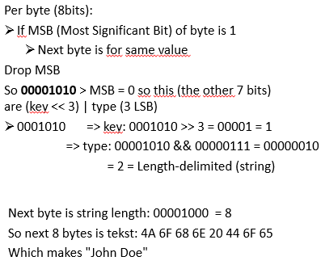  

### Protocol Buffers: Default Values
- For **string**, default is an **empty string**
- For **bytes**, the default value is **empty bytes**
- For **bools** the default value is **false**
- For **numeric types**, the default is **zero**
- For **enums**, the default value is the **first defined enum value**, which must be 0.
- For **message fields**, the field is **not set**

### Service definition
- .proto file
- Describes the methods (service) and data (message)

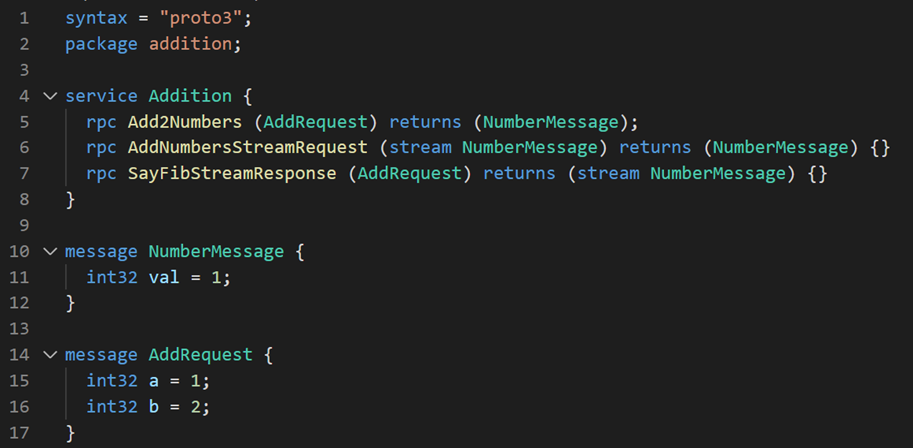  

Alles is afgelijnd, je weet wat je binnenkrijgt of gaat krijgen.

Services zijn "routes" zoals REST API.

- Build for specific language (via protoc)
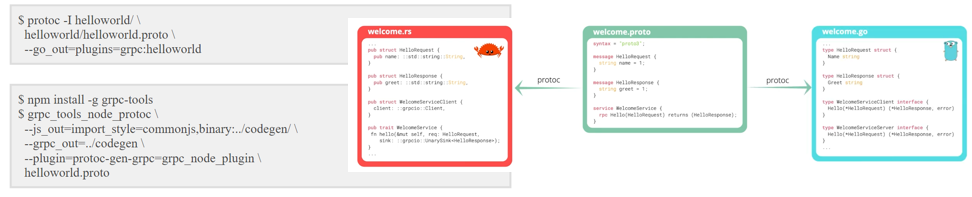  


### Python stub
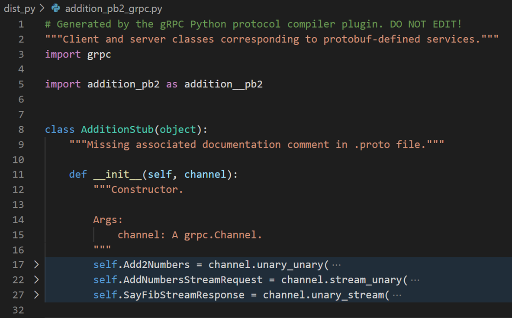  

Klasse binnentrekken en methodes erop kunnen gebruiken.

### gRPC - request types
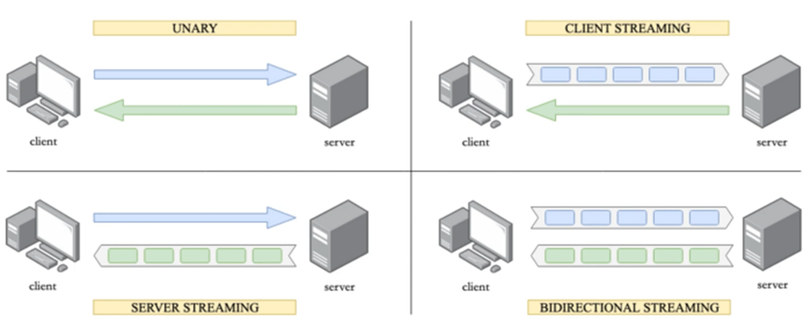

Unary, Client Streaming, Server Streaming, Bidirectional Streaming

### gRPC - Unary
Classic Request-Response Relationship

- **Client** sends a single message to the server
- **Server** responds with a single message

*Websites, Apps, wherever REST API is using*

### gRPC - Server Streaming
- **Client** sends a single message to the server
- **Server** responds with a sequence of messages

*Real-time dashboards*

No polling

### gRPC - Client Streaming
- **Client** sends a sequence of messages to the server
- **Server** responds with a single message

*Realtime location tracking*

### gRPC - Bi-directional Streaming
- **Client** sends a sequence of messages to the server
- **Server** responds with a sequence of messages

*Online games, Video chats...*

### gRPC -
Good for native applications: IOS/Android
Python, C#, Dart, Go

**BUT...**
### ...gRPC client - web
- Not native (too little control over http2 in browser)
- Via proxy

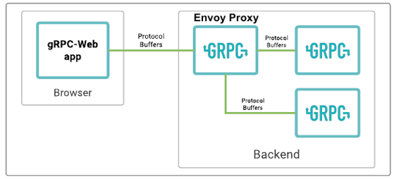  

### gRPC: growing API
- Name of fields are less important than field numbers (**no duplicate numbers!**)
- Do not change the type or number of a field
- Adding fields is safe
- Watch out with required fields
- Deprecate a field before removal
- Reuse a field number *if absolutely sure*
- Be aware of the default values for the data types
- If you need a version set it in package name
  - *E.g. company.service.v1*

*TIP: Begin met kleine keys (< 15)*

### gRPC - When to use
- Communicatie tussen services
  - Real-time
  - Streaming
- Native communicatie (servers/microcontrollers/mobile devices)
  - multi-language environments
- Internal APIs
- Low latency, highly scalable, distributed systems
- Developing mobile clients which are communicating to a cloud server
- Designing a new protocol that needs to be accurate, efficient and language independent
- Layered design to enable extension eg. authentication, load balancing, logging and monitoring etc.
- Microservices: gRPC is designed for low latency and high troughput communication. gRPC is great for lightweight microservices where efficiency is critical.
- Point-to-point real-time communication: gRPC has excellent support for bi-directional streaming. gRPC services can push messages in real-time without polling.
- Polyglot environments: gRPC tooling supports all popular development languages, making gRPC a good choice for multi-language environments.
- Network constrained environments: gRPC messages are serialized with Protobuf, a lightweight message format. A gRPC message is always smaller than an equivalent JSON message.
- Inter-process communication (IPC): IPC transports such as Unix domain sockets and named pipes can be used with gRPC to communicate between apps on the same machine. For more information, see Inter-process communication with gRPC.

### gRPC - Users
- Google (Cloud Services APIs and internally)
- Square (internal RPC)
- Lyft
- Netflix
- WePay
- Namely
- Oqton
- ...

## Remember
- gRPC makes you think you are calling **local methods**
- gRPC is **fast**
  - Binary encoding
- gRPC is **structured** (more time while setting up, less time debugging)
  - Good for working across teams / locations
- gRPC has a **native implementation** across many languages
  - Create **stubs** with protoc
- gRPC is good for **microservice architecture**
- **Not ideal for browser**, but workable
  - HTTP/2 limitation